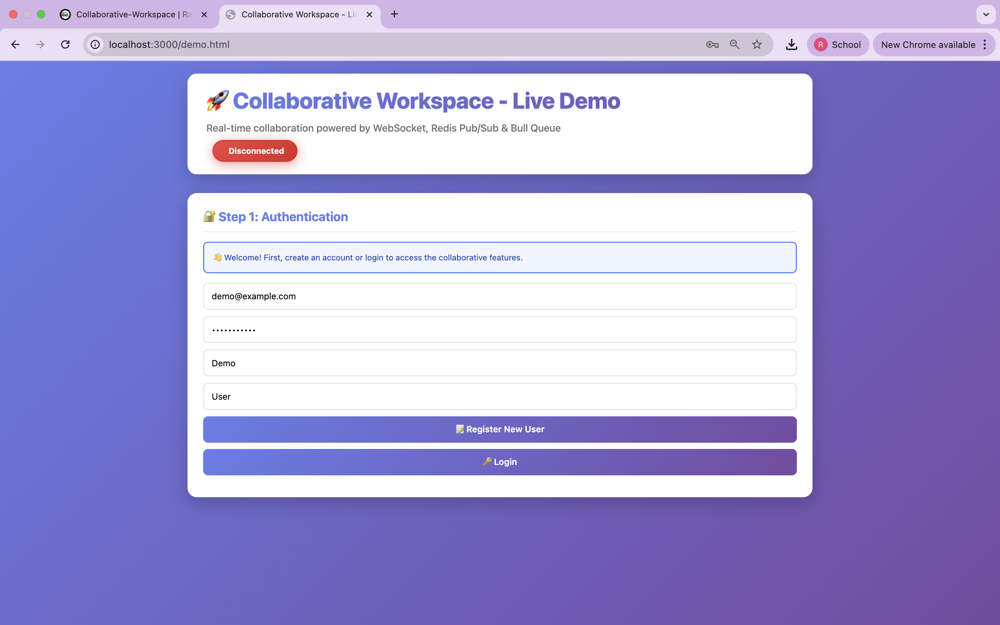
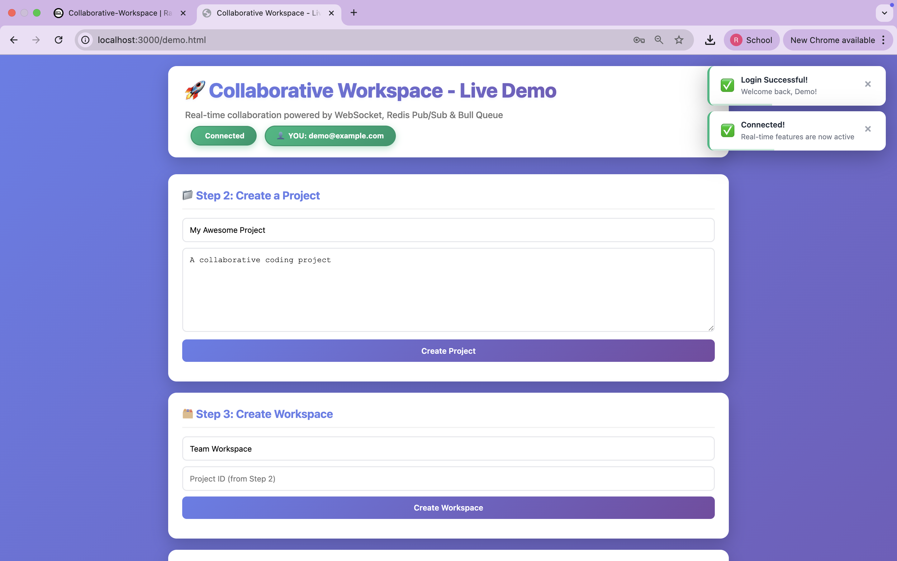
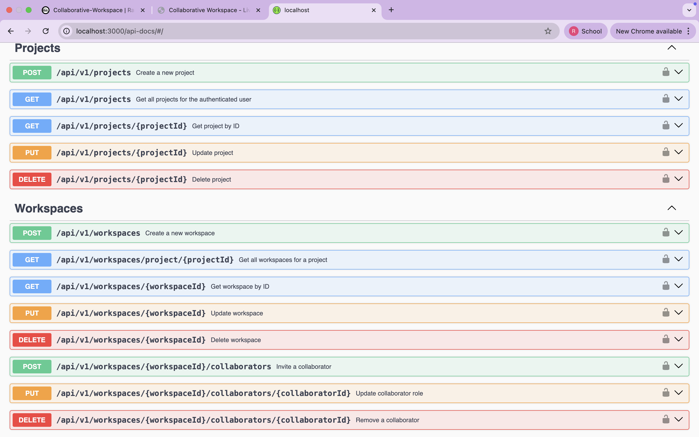
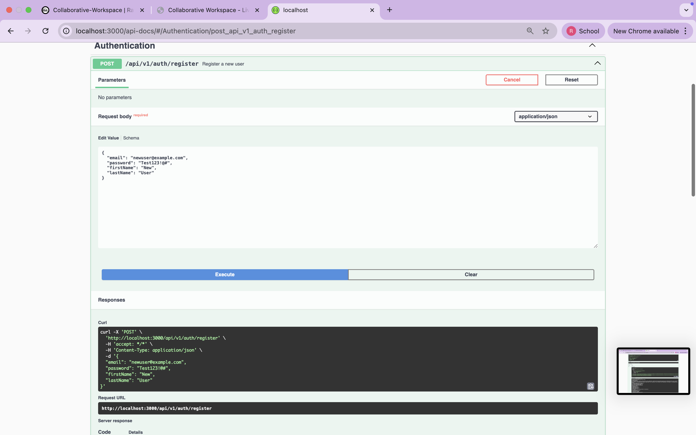
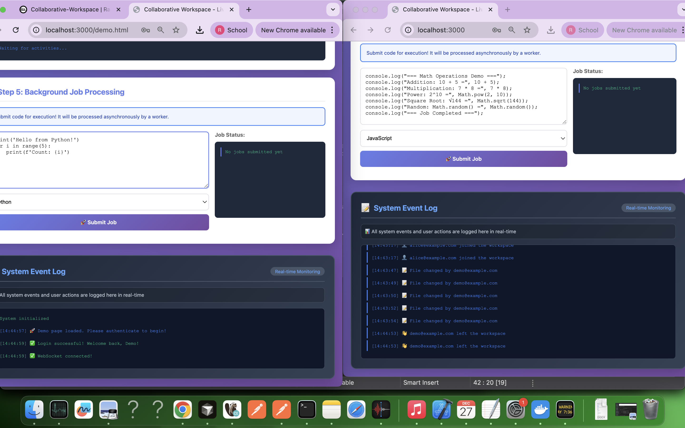
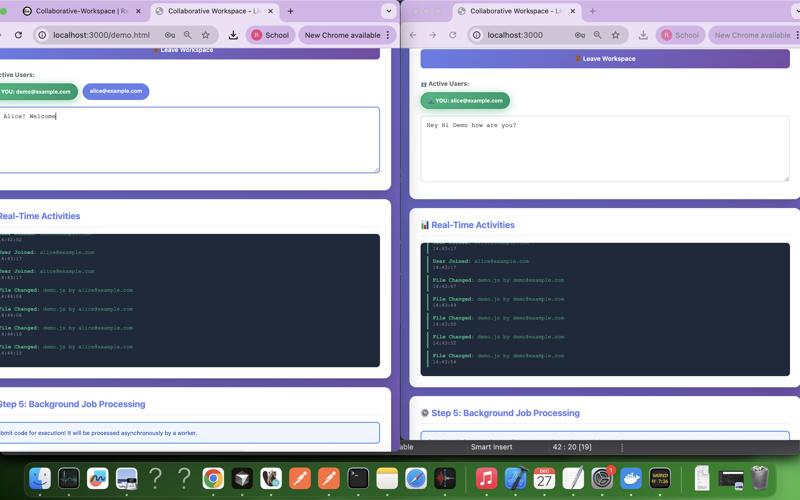

# Real-Time Collaborative Workspace Backend

[](https://github.com/yourusername/collaborative-workspace/actions)
[](https://opensource.org/licenses/MIT)

A production-grade backend service for a real-time collaborative workspace platform, similar to collaborative coding environments. Built with scalability, security, and performance in mind.

## 📸 Screenshots

<div align="center">

### Demo Page Interface


### Login Success & WebSocket Connection


### Swagger UI - Complete Interface


### Swagger - User Registration


### Swagger - Authorization


### Real-Time Collaboration Logs


### User Joined Workspace


### Job Processing


### Job Submitted


### Live Deployment on Railway


### Console Logs with Emojis


</div>

---

## Table of Contents

- [Features](#features)
- [Tech Stack](#tech-stack)
- [Architecture](#architecture)
- [Prerequisites](#prerequisites)
- [Installation](#installation)
- [Configuration](#configuration)
- [Running the Application](#running-the-application)
- [API Documentation](#api-documentation)
- [Testing](#testing)
- [Deployment](#deployment)
- [Security](#security)
- [Performance](#performance)
- [Design Decisions](#design-decisions)

## Features

### Authentication & Authorization
- JWT-based authentication with access and refresh tokens
- Role-based access control (Owner, Collaborator, Viewer)
- Token refresh mechanism
- API rate limiting (general, auth-specific, and API-specific)
- Secure password hashing with bcrypt

### Project & Workspace Management
- RESTful APIs for CRUD operations
- Project ownership and status management
- Workspace creation and management
- Collaborator invitation and role assignment
- OpenAPI/Swagger documentation

### Real-Time Collaboration
- WebSocket-based communication using Socket.io
- Event broadcasting (user join/leave, file changes, cursor movements, activities)
- Redis Pub/Sub for horizontal scaling
- Activity tracking and persistence

### Asynchronous Job Processing
- Bull queue (Redis-based) for job management
- Multiple job types (code execution, file processing, workspace export)
- Retry logic with exponential backoff
- Failure handling and error tracking
- Idempotent job processing
- Job status tracking and monitoring

### Data Storage
- PostgreSQL for relational data (users, projects, workspaces, collaborators)
- MongoDB for document storage (jobs, activities)
- Redis for caching and message brokering
- Proper indexing and query optimization

### Non-Functional Requirements
- Redis caching with TTL
- Horizontally scalable architecture
- Async/non-blocking I/O
- Comprehensive unit and integration tests (>70% coverage)
- Docker and Docker Compose setup
- CI/CD pipeline with GitHub Actions
- Input validation and sanitization
- SQL/NoSQL injection protection
- Environment-based configuration
- CORS configuration
- Structured logging with Winston
- Health checks and monitoring
- Feature flags
- Clean architecture patterns

## Tech Stack

### Core
- **Runtime**: Node.js 18+
- **Language**: TypeScript
- **Framework**: Express.js

### Databases
- **PostgreSQL**: Relational data storage
- **MongoDB**: Document storage for logs and activities
- **Redis**: Caching and message broker

### Real-Time & Messaging
- **Socket.io**: WebSocket communication
- **Bull**: Job queue management
- **Redis Pub/Sub**: Event distribution

### Testing
- **Jest**: Testing framework
- **Supertest**: HTTP assertions
- **ts-jest**: TypeScript support for Jest

### DevOps
- **Docker**: Containerization
- **Docker Compose**: Multi-container orchestration
- **GitHub Actions**: CI/CD pipeline

### Security & Validation
- **Helmet**: Security headers
- **express-rate-limit**: Rate limiting
- **express-validator**: Request validation
- **jsonwebtoken**: JWT implementation
- **bcryptjs**: Password hashing

## Architecture

```
┌─────────────────────────────────────────────────────────────────┐
│                         Load Balancer                            │
└───────────────────────────┬─────────────────────────────────────┘
                            │
            ┌───────────────┴───────────────┐
            │                               │
┌───────────▼──────────┐       ┌───────────▼──────────┐
│   API Server (1)     │       │   API Server (2)     │
│  - REST APIs         │       │  - REST APIs         │
│  - WebSocket         │       │  - WebSocket         │
└───────┬──────────────┘       └───────┬──────────────┘
        │                               │
        └───────────────┬───────────────┘
                        │
        ┌───────────────┼───────────────┐
        │               │               │
┌───────▼──────┐ ┌──────▼─────┐ ┌──────▼─────┐
│  PostgreSQL  │ │  MongoDB   │ │   Redis    │
│  (Relational)│ │ (Documents)│ │  (Cache &  │
│              │ │            │ │   Queue)   │
└──────────────┘ └────────────┘ └──────┬─────┘
                                       │
                                ┌──────▼─────┐
                                │   Worker   │
                                │   (Bull)   │
                                └────────────┘
```

### Key Design Patterns

1. **Layered Architecture**: Controllers → Services → Database
2. **Repository Pattern**: Database abstraction with TypeORM and Mongoose
3. **Dependency Injection**: Configuration-based service initialization
4. **Middleware Pattern**: Authentication, validation, error handling
5. **Pub/Sub Pattern**: Redis-based event distribution for scalability
6. **Queue Pattern**: Asynchronous job processing with Bull

## Prerequisites

- Node.js 18.x or higher
- npm 9.x or higher
- Docker and Docker Compose (for containerized deployment)
- PostgreSQL 15+ (if running locally)
- MongoDB 7+ (if running locally)
- Redis 7+ (if running locally)

## Installation

### Clone the repository

```bash
git clone https://github.com/yourusername/collaborative-workspace.git
cd collaborative-workspace
```

### Install dependencies

```bash
npm install
```

### Environment setup

```bash
cp .env.example .env
```

Edit `.env` with your configuration values.

## Configuration

Key environment variables:

```env
# Application
NODE_ENV=development
PORT=3000
API_VERSION=v1

# JWT
JWT_SECRET=your-secret-key
JWT_REFRESH_SECRET=your-refresh-secret
JWT_EXPIRES_IN=15m
JWT_REFRESH_EXPIRES_IN=7d

# PostgreSQL
POSTGRES_HOST=localhost
POSTGRES_PORT=5432
POSTGRES_USER=workspace_user
POSTGRES_PASSWORD=workspace_password
POSTGRES_DB=collaborative_workspace

# MongoDB
MONGODB_URI=mongodb://localhost:27017/collaborative_workspace

# Redis
REDISHOST=localhost
REDISPORT=6379

# Rate Limiting
RATE_LIMIT_WINDOW_MS=900000
RATE_LIMIT_MAX_REQUESTS=100

# Feature Flags
FEATURE_ADVANCED_ANALYTICS=false
FEATURE_CODE_EXECUTION=true
```

## Running the Application

### Development Mode

```bash
# Start all services with Docker Compose
docker-compose up -d

# Or run locally (requires databases running)
npm run dev

# Run worker in separate terminal
npm run worker
```

### Production Mode

```bash
# Build TypeScript
npm run build

# Start production server
npm start
```

### Docker Deployment

```bash
# Build and start all services
docker-compose up -d

# View logs
docker-compose logs -f

# Stop all services
docker-compose down
```

## API Documentation

### Accessing Documentation

Once the server is running, access the interactive Swagger documentation at:

```
http://localhost:3000/api-docs
```

<div align="center">

<p><em>Interactive API testing with Swagger UI</em></p>
</div>

### API Endpoints Overview

#### Authentication
- `POST /api/v1/auth/register` - Register new user
- `POST /api/v1/auth/login` - User login
- `POST /api/v1/auth/refresh` - Refresh access token
- `POST /api/v1/auth/logout` - User logout

#### Projects
- `POST /api/v1/projects` - Create project
- `GET /api/v1/projects` - List projects
- `GET /api/v1/projects/:id` - Get project details
- `PUT /api/v1/projects/:id` - Update project
- `DELETE /api/v1/projects/:id` - Delete project

#### Workspaces
- `POST /api/v1/workspaces` - Create workspace
- `GET /api/v1/workspaces/project/:projectId` - List workspaces
- `GET /api/v1/workspaces/:id` - Get workspace details
- `PUT /api/v1/workspaces/:id` - Update workspace
- `DELETE /api/v1/workspaces/:id` - Delete workspace
- `POST /api/v1/workspaces/:id/collaborators` - Invite collaborator
- `PUT /api/v1/workspaces/:id/collaborators/:collaboratorId` - Update role
- `DELETE /api/v1/workspaces/:id/collaborators/:collaboratorId` - Remove collaborator

#### Jobs
- `POST /api/v1/jobs` - Create job
- `GET /api/v1/jobs` - List user jobs
- `GET /api/v1/jobs/:id` - Get job status
- `POST /api/v1/jobs/:id/retry` - Retry failed job

#### WebSocket Events

**Client → Server:**
- `join_workspace` - Join a workspace room
- `leave_workspace` - Leave a workspace room
- `file_change` - Broadcast file changes
- `cursor_move` - Broadcast cursor position
- `activity_update` - Broadcast activity updates

**Server → Client:**
- `user_joined` - User joined workspace
- `user_left` - User left workspace
- `file_change` - File was changed
- `cursor_move` - Cursor moved
- `activity_update` - Activity updated

### Example Usage

#### Register and Login

```bash
# Register
curl -X POST http://localhost:3000/api/v1/auth/register \
  -H "Content-Type: application/json" \
  -d '{
    "email": "user@example.com",
    "password": "SecurePass123",
    "firstName": "John",
    "lastName": "Doe"
  }'

# Login
curl -X POST http://localhost:3000/api/v1/auth/login \
  -H "Content-Type: application/json" \
  -d '{
    "email": "user@example.com",
    "password": "SecurePass123"
  }'
```

#### Create Project

```bash
curl -X POST http://localhost:3000/api/v1/projects \
  -H "Authorization: Bearer YOUR_ACCESS_TOKEN" \
  -H "Content-Type: application/json" \
  -d '{
    "name": "My Project",
    "description": "Project description"
  }'
```

#### WebSocket Connection

```javascript
import io from 'socket.io-client';

const socket = io('http://localhost:3000', {
  auth: {
    token: 'YOUR_ACCESS_TOKEN'
  }
});

socket.on('connect', () => {
  console.log('Connected');
  socket.emit('join_workspace', 'workspace-id');
});

socket.on('user_joined', (data) => {
  console.log('User joined:', data);
});

socket.emit('file_change', {
  fileName: 'index.ts',
  changes: { /* ... */ }
});
```

## Testing

### Run all tests

```bash
npm test
```

### Run tests with coverage

```bash
npm test -- --coverage
```

### Run specific test file

```bash
npm test -- authService.test.ts
```

### Run integration tests

```bash
npm run test:integration
```

### Coverage Report

Tests achieve >70% code coverage across:
- Unit tests for services and utilities
- Integration tests for API endpoints
- Cache service tests
- Authentication flow tests

## Deployment

### Docker Compose (Recommended)

```bash
# Production deployment
docker-compose -f docker-compose.yml up -d

# Check status
docker-compose ps

# View logs
docker-compose logs -f api
```

### Kubernetes (Advanced)

Create Kubernetes manifests based on the Docker setup:
- Deployment for API servers
- Deployment for workers
- StatefulSet for databases
- Services for load balancing
- ConfigMaps for configuration
- Secrets for sensitive data

### Cloud Platforms

**AWS:**
- ECS/EKS for container orchestration
- RDS for PostgreSQL
- DocumentDB for MongoDB
- ElastiCache for Redis
- ALB for load balancing

**Google Cloud:**
- GKE for Kubernetes
- Cloud SQL for PostgreSQL
- MongoDB Atlas
- Memorystore for Redis

**Azure:**
- AKS for Kubernetes
- Azure Database for PostgreSQL
- Cosmos DB
- Azure Cache for Redis

## Security

### Implemented Security Measures

1. **Authentication**: JWT with short-lived access tokens and long-lived refresh tokens
2. **Authorization**: Role-based access control (RBAC)
3. **Rate Limiting**: Multiple rate limiters (general, auth, API-specific)
4. **Input Validation**: express-validator for all inputs
5. **SQL Injection Protection**: TypeORM parameterized queries
6. **NoSQL Injection Protection**: Mongoose schema validation
7. **Helmet**: Security headers (XSS, CSP, etc.)
8. **CORS**: Configurable origin restrictions
9. **Password Security**: bcrypt with salt rounds
10. **Environment Variables**: Secure secrets management
11. **Error Handling**: No sensitive data in error responses

### Security Best Practices

- Always use HTTPS in production
- Rotate JWT secrets regularly
- Keep dependencies updated
- Use secrets management services (AWS Secrets Manager, HashiCorp Vault)
- Enable database encryption at rest
- Implement API gateway for additional security layer
- Monitor and log security events
- Regular security audits

## Performance

### Optimization Techniques

1. **Caching**: Redis caching with TTL for frequently accessed data
2. **Database Indexing**: Proper indexes on frequently queried fields
3. **Connection Pooling**: Database connection management
4. **Async Processing**: Bull queue for heavy operations
5. **Horizontal Scaling**: Stateless API servers with Redis Pub/Sub
6. **Query Optimization**: Efficient database queries with pagination
7. **Compression**: Response compression (gzip)
8. **Load Balancing**: Support for multiple server instances

### Scalability Considerations

- **Stateless Design**: API servers can be scaled horizontally
- **Redis Pub/Sub**: WebSocket events distributed across instances
- **Job Queue**: Workers can be scaled independently
- **Database Sharding**: PostgreSQL and MongoDB support sharding
- **CDN Integration**: Static assets can be served via CDN
- **Microservices Ready**: Architecture supports service decomposition

## Design Decisions

### Why TypeScript?
- Type safety reduces runtime errors
- Better IDE support and autocomplete
- Self-documenting code
- Easier refactoring

### Why PostgreSQL + MongoDB + Redis?
- **PostgreSQL**: ACID compliance for critical data (users, projects)
- **MongoDB**: Flexible schema for logs and activities
- **Redis**: High-performance caching and messaging

### Why Socket.io over native WebSocket?
- Automatic reconnection
- Room support for workspace isolation
- Fallback mechanisms
- Better developer experience

### Why Bull over other queues?
- Redis-based (already in stack)
- Excellent TypeScript support
- Built-in retry logic
- Good monitoring capabilities

### Why Express.js?
- Mature and battle-tested
- Large ecosystem
- Flexible middleware system
- Excellent TypeScript support

### Trade-offs

1. **Complexity vs Features**: Multi-database architecture adds complexity but provides flexibility
2. **Consistency vs Performance**: Eventual consistency for some features (activities) for better performance
3. **Memory vs Speed**: Redis caching uses memory for faster response times
4. **Development Speed vs Type Safety**: TypeScript adds development overhead but prevents bugs

## Monitoring & Observability

### Logging
- Structured logging with Winston
- Log levels: error, warn, info, debug
- Separate log files for different levels
- Log rotation recommended for production

### Metrics
- Health check endpoint (`/health`)
- Job queue metrics (Bull dashboard integration possible)
- Database connection pooling metrics
- API response times

### Recommended Tools
- **Application Monitoring**: New Relic, Datadog
- **Log Aggregation**: ELK Stack, Splunk
- **Error Tracking**: Sentry
- **Uptime Monitoring**: Pingdom, UptimeRobot


